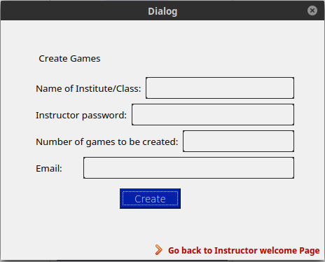

# My Beer Game

You are now in charge of creating a system that would efficiently produce and sell Beer, with the ultimate goal of making sure everyone on the planet (or the galaxy) has enough beers forever. So use this software to manage your beer suppy chain properly.

### Installing

A step by step series of examples that tell you how to get a development env running

You have to set your Qt location in CMakeLists if it doenst work via set(CMAKE_PREFIX_PATH PATH_TO_QT)

Place the follwoing step into terminal to build the project.

```
mkdir build && cd build && cmake ..
```

You can now make the project

```
make
```

To execute the project you need to run
```
./beergame
```

### Current UI Guide 

Currently a login ui has been implement where :

For Instructor:
```
User Email : test
Password   : 1234
Instructor : ✅ (True)
```
For Player:
```
User Email : player
Password   : 1234
Instructor : (Not ticked : False)
```

Place the follwoing step into terminal to build the project.





## Built With

* [QT5](qt.io) - The GUI framework used
* [Cmake](https://cmake.org) - Dependency Management
* [Doxygen](http://www.doxygen.nl) - Used to generate docs


## Contributors

Roles are associated as follows:
1->Factory 2->Distributor 3->Wholesaler 4->Retailer

Note that:
The array of Players starts from position 0 so the roles have to be shifted by -1 in order to acces the 
proper entries in the array.

Upstream:
For all players except the Factory the upstream is returned
Downstream:
For all players except the Retailer the upstream is returned

ExecuteOrders:
All the players besides the factory (reason why loop starts at 1 and not at 0)
are requested to enter the number of beers to be ordered to the upstream.
ExecuteShipments:
Similarly all the entities send a shipment to the downstream except for the retailer.
In this case amounts of shipments are sent and calculated automatically from the getAvailableShipments 
function which makes sure that the inventory never goes negative.
In this case the number of beers to be shipped is accessed from the orders map on the entry denoting 2 weeks
ago i.e. currentWeek-2.

addOrder:
For a given role an instance of an order is being created and put into the map of orders at the proper week entry
at the proper role spot.
addShipment:
The same is done for addShipment but in this case the created instance is a shipment and the container to be
inserted in is the shipmentsToBeExecuted array

startGame initializes the game i.e. sets the numberofweeks, adds players to the array of players and makes sure that no 2 players play with the same role. After that a while loop runs for n rounds to execute orders and shipments for each player. This part needs to be filled with more info w.r.t data printing.


