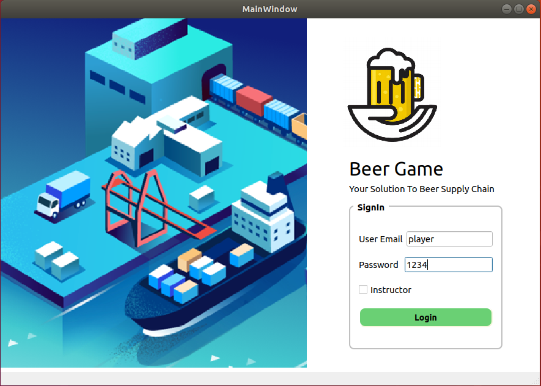
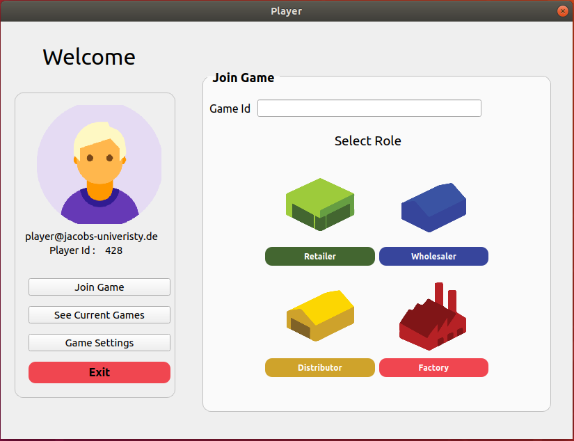

# My Beer Game

 You are now in charge of creating a system that would efficiently produce and sell Beer, with the ultimate goal of making sure everyone on the planet (or the galaxy) has enough beers forever. So use this software to manage your beer suppy chain properly.

## Getting Started

These instructions will get you a copy of the project up and running on your local machine for development and testing purposes.

### Prerequisites

What things you need to install the software and how to install them

```
GNU C++: https://gcc.gnu.org/install/
Qt: https://www.qt.io/download
CMake: https://cmake.org/install
Doxygen: https://sourceforge.net/projects/doxygen/
```

### Installing

A step by step series of examples that tell you how to get a development env running

You have to set your Qt location in CMakeLists if it doenst work via set(CMAKE_PREFIX_PATH PATH_TO_QT)

Place the follwoing step into terminal to build the project.

```
mkdir build && cd build && cmake ..
```

You can now make the project

```
make
```

To execute the project you need to run
```
./beergame
```

to execute the testing

```
./beergame-test
```

and to make docs run

```
make doc
```

and then the documentation can be found in the directory `doc` and in the directory `doc`.

### Current UI Guide 

Currently a login ui has been implement where :

For Instructor:
```
User Email : test
Password   : 1234
Instructor : ✅ (True)
```
For Player:
```
User Email : player
Password   : 1234
Instructor : (Not ticked : False)
```

Place the follwoing step into terminal to build the project.




## Built With

* [QT5](qt.io) - The GUI framework used
* [Cmake](https://cmake.org) - Dependency Management
* [Doxygen](http://www.doxygen.nl) - Used to generate docs


## Contributors

* **Digdarshan Kunwar** - *Sprint 1* - [Github](https://github.com/digggy )
    #### Contributions:

        * Documentation ✅
        * Tests (Added Few)✅
        * Classes Implementation ✅
        * UI ✅
    
* **Abumansur Sabyrrakhim** - *Sprint 1* - [Github](https://github.com/@sabyrrakhim06 )
    #### Contributions:
        * Documentation ✅
        * Classes Implementation ✅
        
## Acknowledgments

* Software engineering Teaching Assistants


